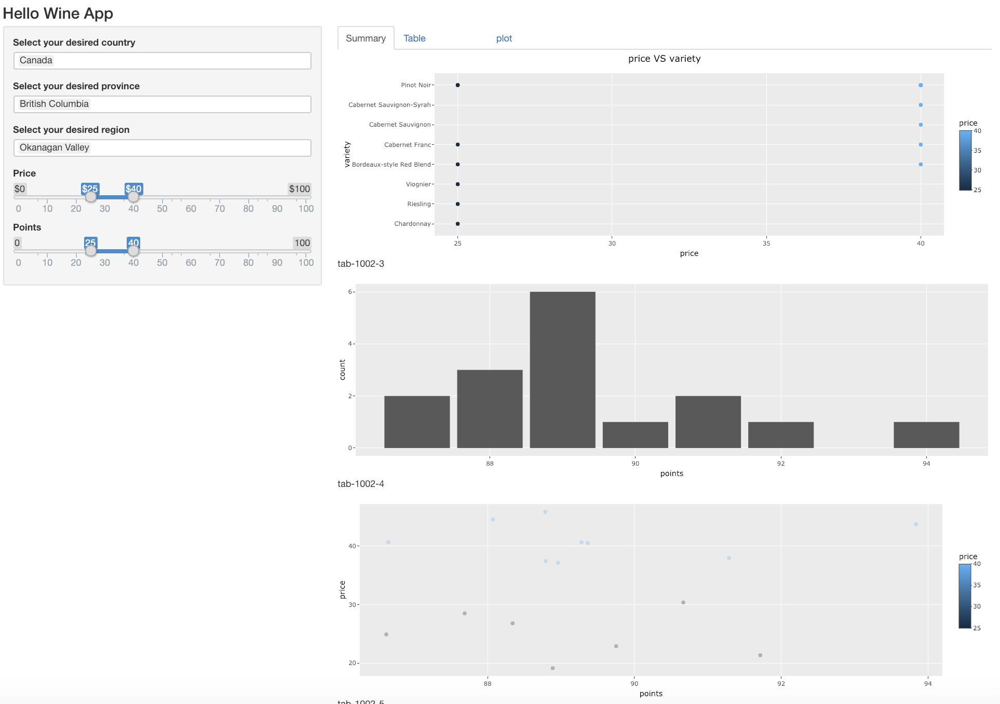
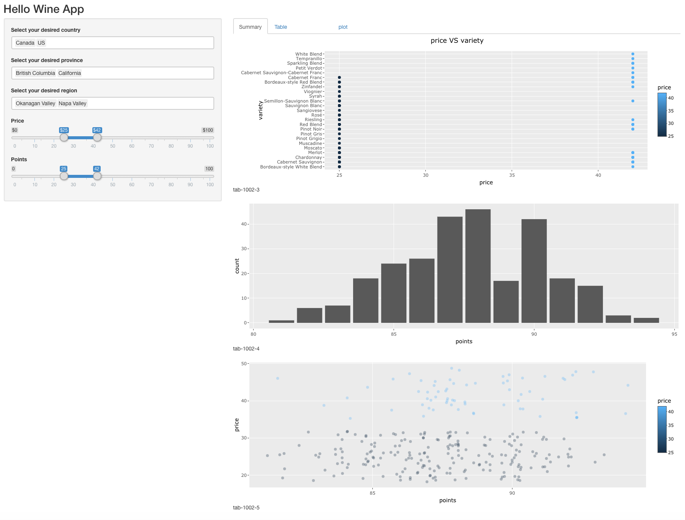
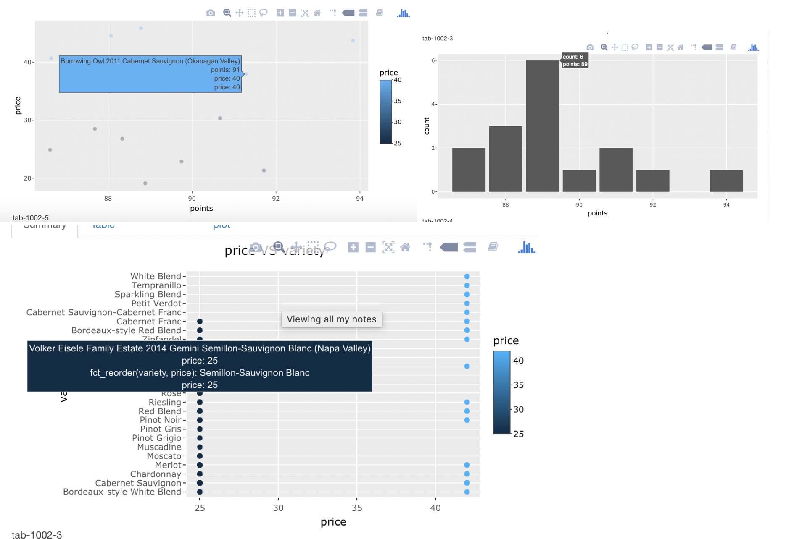

##  Functionality 

## Overview

This is the landing page of our app. On the left, we have three filter options (drop down) and two sliders options. On the right, we have three interactive plots. Default input of country is `Canada`, province is `British Columbia` and region is `Okanagan Valley`. 

## Filter 

This page shows that users can select multiple coutries, provinces and regions. In addition to this, options of provinces will limit based on countries' choice, and options of regions will limit based on provinces' choice. The three plots will change depends on users' choice. 

## Interaction

We use plotly to render the plots so that users see the specific data and get the interaction information. 
